## A PFD-CP Type-II ∆Σ Fractional-N Phase Locked Loop (PLL) Clock Multiplier Layout in IHP SG13G2 Process

### 1. Members (Department of Electronic and Telecommunication Engineering, University of Moratuwa)

- Yasiru Amarasinghe (T1)
- Nilasi Methsarani (T1)
- Nimesh Kavinda (T1)
- Avishka Herath (T2)
- Manimohan Thiriloganathan (T2)
- Hansa Marasinghe (T2)
- Upeksha Dilhara (T2)
- Instructor: Kithmin Wickremasinghe (MASc).
- Supervisor: Dr. Subramaniam Thayaparan (PhD).

### 2. Overview of the Project:

The PLL is a charge-pump (CP) based (Type-II) PLL which uses a standard fractional-N architecture, where an output frequency divider (FD) is used to set the frequency multiplication with respect to the reference clock input. The output frequency `f_out` is `N * f_ref`, where `N` is the division ratio of `XDIV_OUT` and `f_ref` is the input clock frequency. N can be between 1 and 15, and is designed for a 10 MHz reference input, which implies an output frequency between 10 kHz and 150 MHz. Documentation for the PLL subcells is included below.

### 3. Block Diagram of the Project:

### 4. Specifications of the Project:

### 5. Circuit Design:

#### 5.1 PLL:

#### 5.2 Phase-frequency detector (PFD):

#### 5.3 Charge pump (CP):

 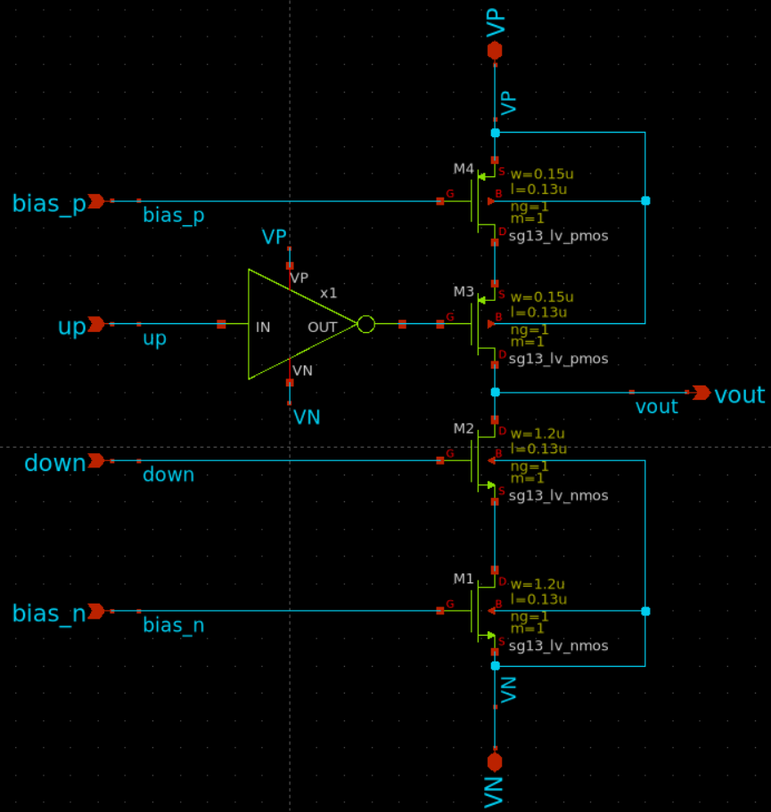 

#### 5.4 Loop filter:

 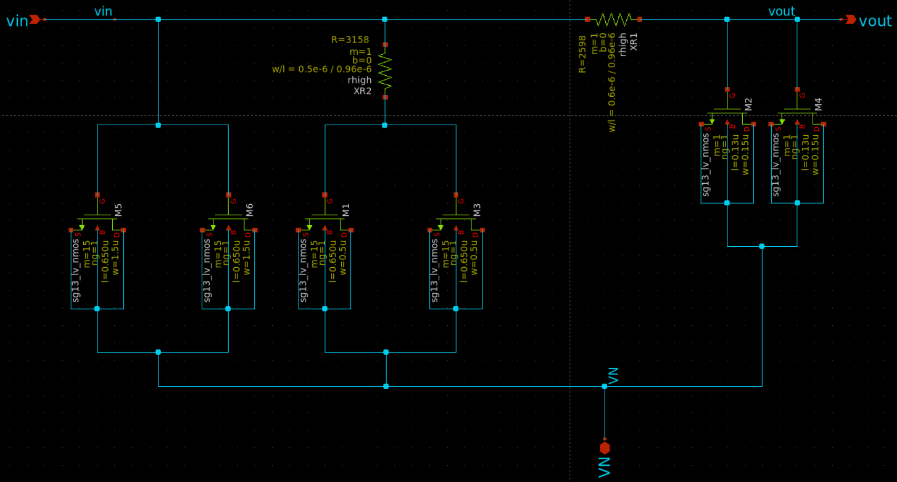 

#### 5.4 Bias Generator:

 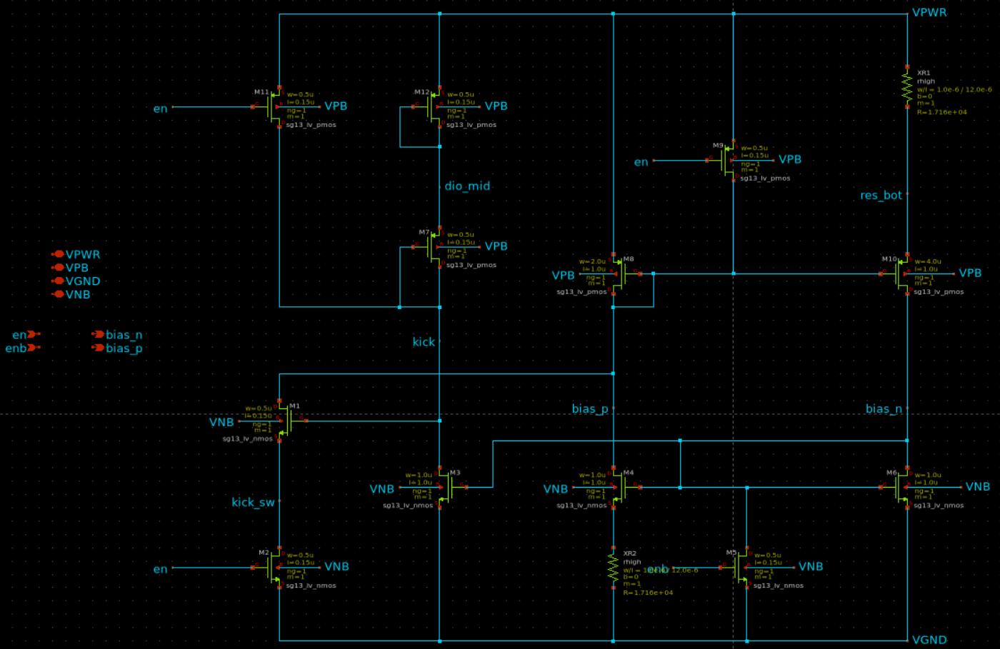 

#### 5.5 Voltage-controlled oscillator (VCO):
##### Inverter for VCO

 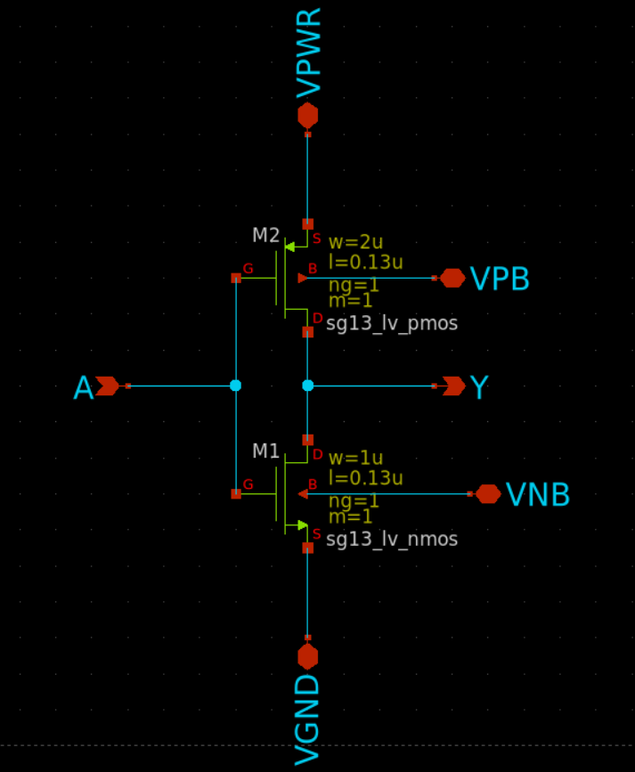 

##### 11-stage Voltage-controlled oscillator (VCO)

 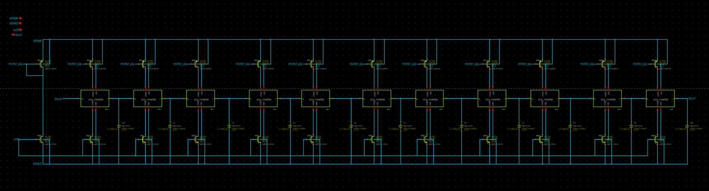 

#### 5.6 Frequency divider (FD):

### 6. Simulation results:

#### 6.1 PLL:

#### 6.2 Voltage-controlled oscillator (VCO):
##### VCO Output waveform at control voltage = 1V

 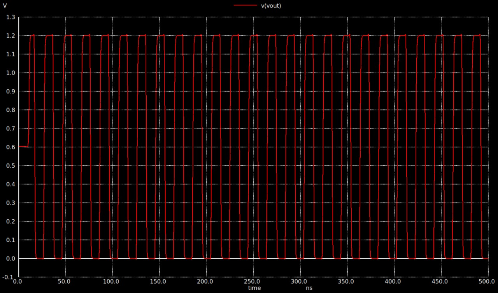 

##### VCO Output frequency spectrum at control voltage = 1V

 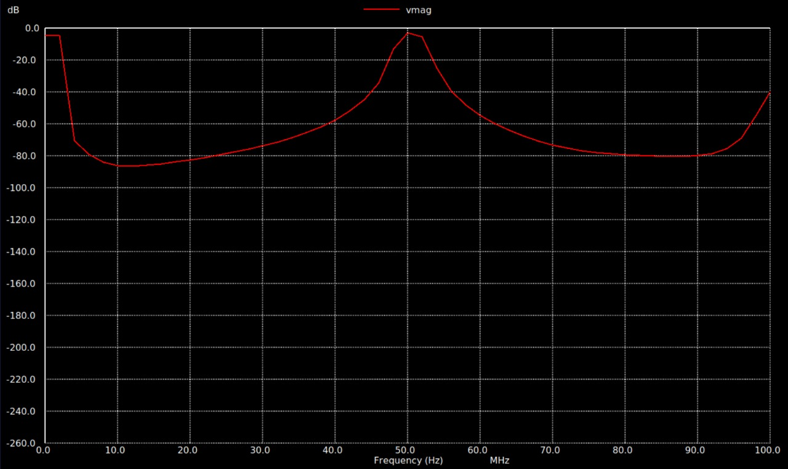 

##### VCO Oscillation Frequency VS Control Voltage

  

#### 6.3 Charge pump (CP):

 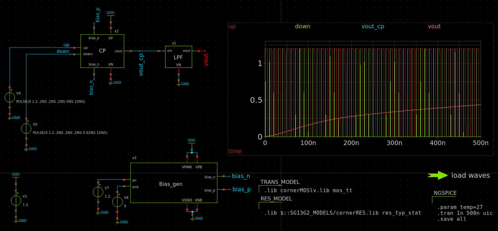 

 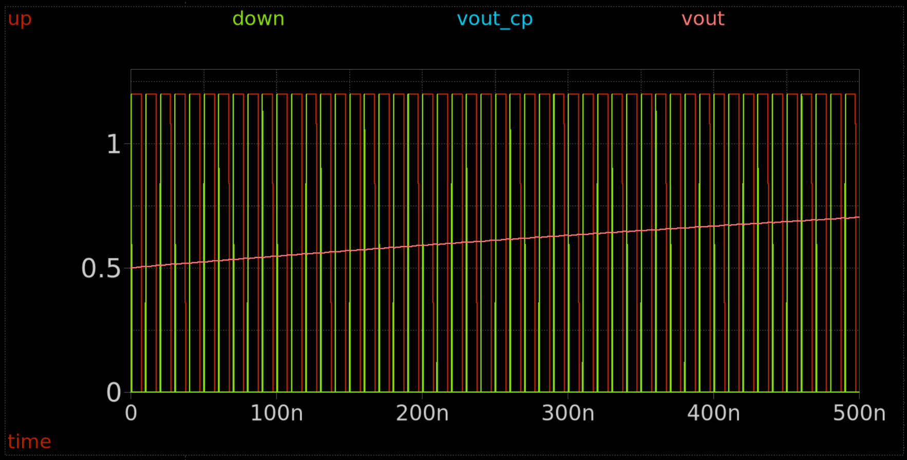 

 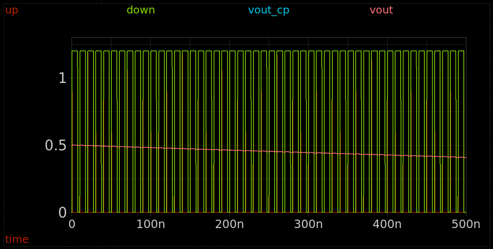 

#### 6.4 Frequency divider (FD):

### 7. Control Interface:

### 8. Layout Design:

##### Charge Pump Layout

 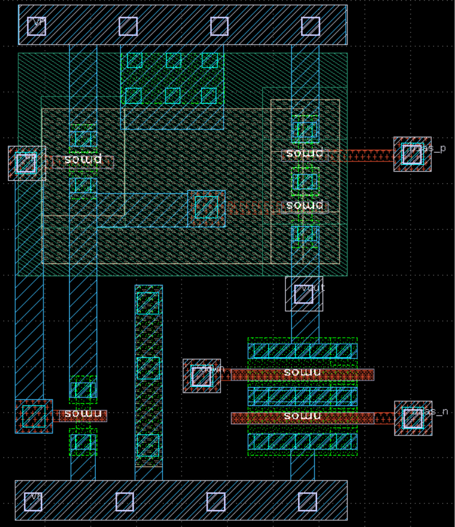 

##### Loop Filter Layout

 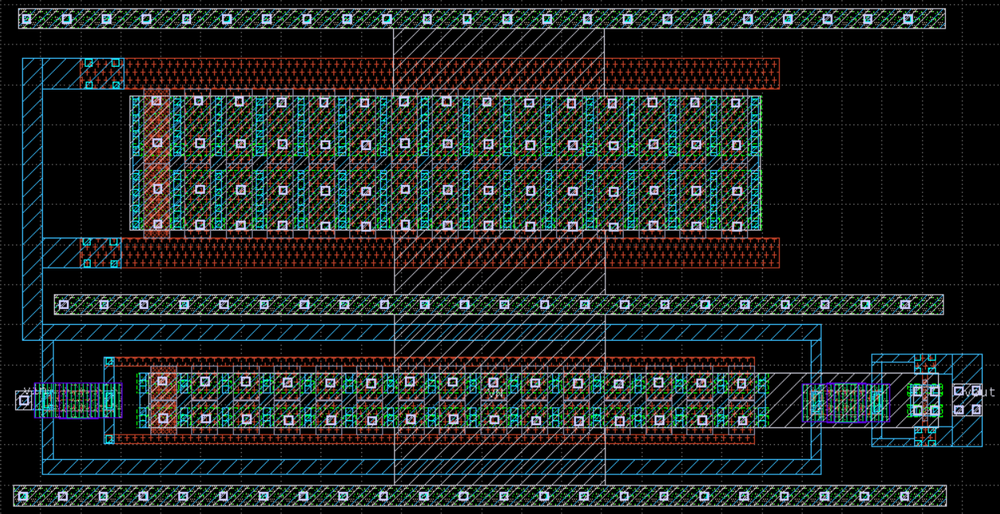 

##### Bias Generator Layout

 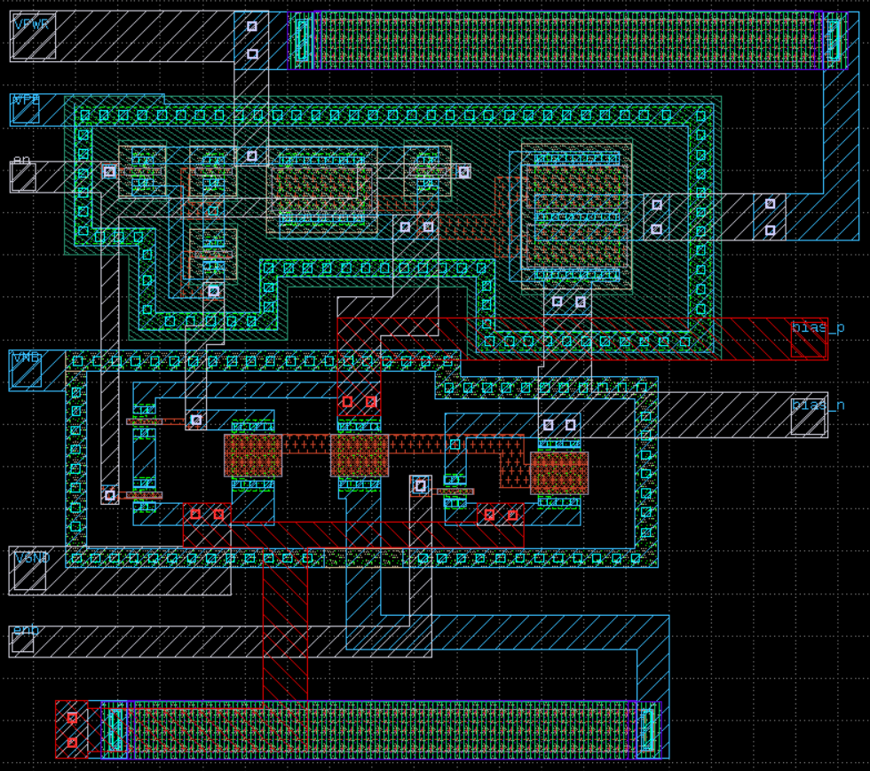 

##### Voltage-controlled oscillator (VCO)  Layout

 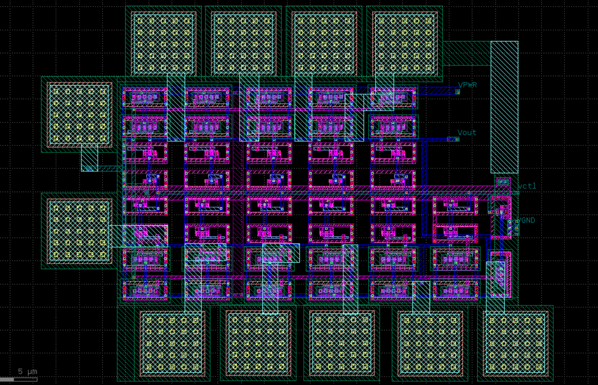 

##### PLL  Layout

 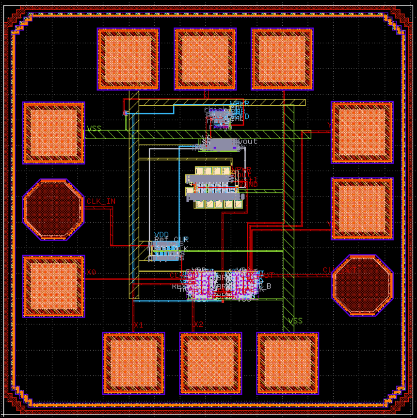 

 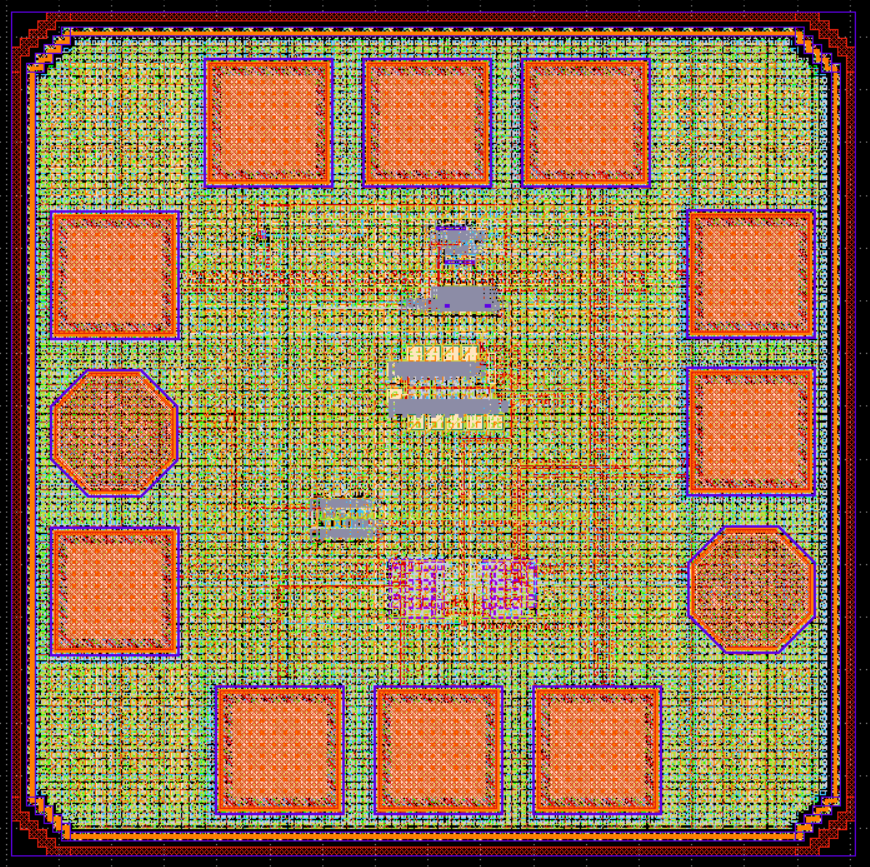 

### 9. Physical Verification (DRC, LVS):

### 10. Post-layout Verification after PEX:

### 11. GDS streaming:
