## A PFD-CP Type-II Fractional-N Phase Locked Loop (PLL) Clock Multiplier Layout in IHP SG13G2 Process

# Table of Contents

1. [Members](#members)
2. [Overview of the Project](#overview)
3. [Block Diagram of the Project](#block)
4. [Specifications of the Project](#specs)
5. [Circuit Design](#circuit)
   - [PLL](#pll)
   - [Phase-frequency detector (PFD)](#pfd)
   - [Charge pump (CP)](#cp)
   - [Loop filter](#lf)
   - [Bias Generator](#bias)
   - [Voltage-controlled oscillator (VCO)](#vco)
   - [Frequency Divider (FD)](#fd)
6. [Simulation Results](#sim)
   - [PLL](#sim_pll)
   - [VCO](#sim_vco)
   - [Charge Pump](#sim_cp)
   - [Frequency Divider](#sim_fd)
7. [Control Interface](#control)
8. [Layout Design](#layout)
9. [Physical Verification (DRC, LVS)](#pv)
10. [Post-layout Verification after PEX](#pex)
11. [GDS Streaming](#gds)

---

## 1. Members (Department of Electronic and Telecommunication Engineering, University of Moratuwa)

- Yasiru Amarasinghe (T1)  
- Nilasi Methsarani (T1)  
- Nimesh Kavinda (T1)  
- Avishka Herath (T2)  
- Manimohan Thiriloganathan (T2)  
- Hansa Marasinghe (T2)  
- Upeksha Dilhara (T2)  
- Instructor: Kithmin Wickremasinghe (MASc)  
- Supervisor: Dr. Subramaniam Thayaparan (PhD)  

[Return to top](#toc)

---

## 2. Overview of the Project

This project implements a charge-pump (CP) based (Type-II) Phase-Locked Loop (PLL) system designed to generate programmable output frequencies from a stable `10 MHz` reference input. The architecture uses a Voltage-Controlled Oscillator (VCO) together with two 3-bit programmable Frequency Dividers (FDs) to achieve a tunable output frequency.

### Architecture

- **Feedback Divider (M):**  
  Divides the VCO output by a `3-bit integer input M`. This allows the PLL to lock the VCO frequency at an integer multiple of the reference input:  
  `f_vco = M × f_ref`

- **Output Divider (N):**  
  Divides the VCO output by a `3-bit integer input N` to produce the final output:  
  `f_out = f_vco / N`

### Frequency Relationship

By configuring **M** and **N** via six digital I/O control pads (3 bits each), the system achieves a fractional multiplication of the reference input:

`f_out = (M / N) × f_ref`

Since both M and N can be varied between 1 and 7, the **theoretical frequency range** spans from `1.428 MHz to 70 MHz`, based on the 3-bit divider limits. However, due to VCO constraints, the **practical output frequency range** is limited to approximately `1.428 MHz to 30 MHz`. This design demonstrates a compact, digitally controlled fractional frequency synthesizer, suitable for clock generation and frequency scaling applications.

[Return to top](#toc)

---

## 3. Block Diagram of the Project

[Return to top](#toc)

---

## 4. Specifications of the Project

### Frequency Range

- **Theoretical:** 1.428 MHz – 70 MHz (from divider limits)  
- **Practical:** 1.428 MHz – 30 MHz (limited by VCO performance)  

[Return to top](#toc)

---

## 5. Circuit Design

### 5.1 PLL

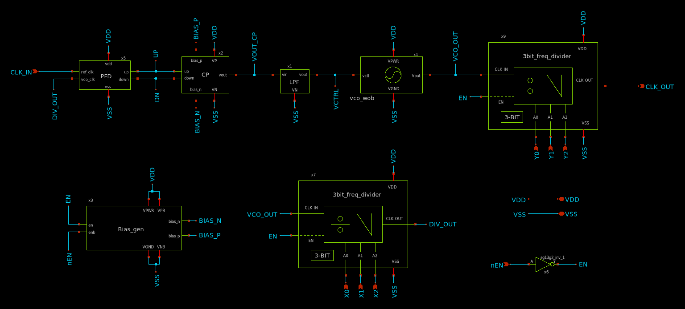

[Return to top](#toc)

### 5.2 Phase-frequency detector (PFD)

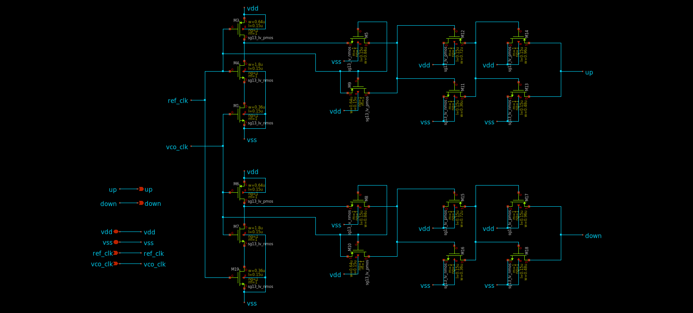
 

[Return to top](#toc)

### 5.3 Charge pump (CP)

  

The charge pump design in this project is based on the [tt08-tiny-pll](https://github.com/LegumeEmittingDiode/tt08-tiny-pll). The charge pump uses two current sources (bias_p and bias_n), which are switched to the output by the up and down control signals. The nominal charge pump current (set by the bias generator) is configurable to suit the PLL requirements.

[Return to top](#toc)

### 5.4 Loop filter

  

[Return to top](#toc)

### 5.5 Bias Generator

  

The bias generator design in this project is also based on the [tt08-tiny-pll](https://github.com/LegumeEmittingDiode/tt08-tiny-pll), but we added an extra resistor to increase bias_n value. The bias generator is a self-biased current mirror, which provides a roughly supply-independent current for the charge pump. A startup circuit is included to ensure the bias generator does not fall into an undesirable operating point where IOUT = 0. The diode devices M3 and M7 charge the kick node to VPWR when the circuit is enabled, which pulls bias_p low and establishes a current in the mirror devices. Once the mirror is active, M3 pulls kick low and disables the startup circuit.

[Return to top](#toc)

### 5.6 Voltage-controlled oscillator (VCO)

Each stage is a standard-cell inverter with delay controlled by current-limiting transistors. The use of eleven stages sets the oscillation frequency in the tens of megahertz range and improves phase noise performance by spreading delay across multiple elements.

A control transistor operating in the triode region regulates the current supplied to the inverter chain, enabling smooth tuning of the oscillation frequency. Minimum channel-length devices are used to maximize the width-to-length ratio, reduce \(V_{DSAT}\), and minimize parasitic capacitances.

Low-threshold (LVT) NMOS devices are employed so that the control voltage operates around mid-supply, ensuring robust operation across process and temperature variations. The nominal oscillation frequency is approximately **50 MHz**, with tuning capability around this point.

Dedicated keeper devices are included to disable the oscillator during standby, achieving **zero static power consumption** when the circuit is turned off.

#### Inverter for VCO

  

#### 11-Stage Ring VCO

  

[Return to top](#toc)

### 5.7 Frequency divider (FD)

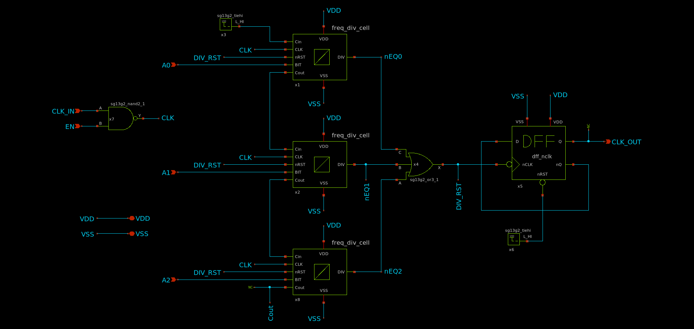
 

#### Frequency Divider Cell

#### Half Adder for Divider

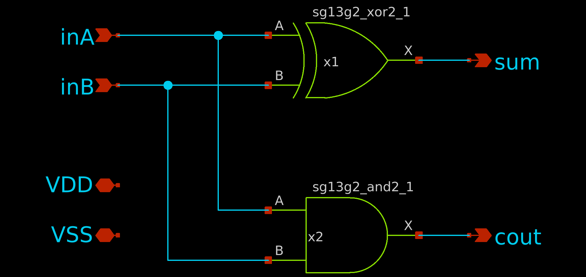

#### DFF with Inverterd CLK for Divider

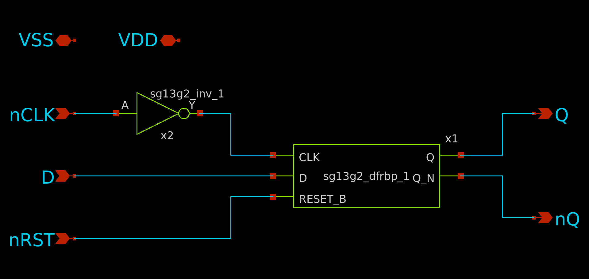

[Return to top](#toc)

---

## 6. Simulation Results

### 6.1 PLL

[Return to top](#toc)

### 6.2 VCO

We used the nominal control voltage as 1V to characterized the VCO.

#### VCO Output waveform at control voltage = 1V  
  

  

#### VCO Output Frequency Spectrum at Control Voltage = 1V 
  

  

#### VCO Oscillation Frequency vs Control Voltage 
The VCO was characterized by measuring its output frequency while sweeping the control voltage. The results of this simulation are shown below:
  

  

[Return to top](#toc)

### 6.3 Charge Pump (CP)

  

  

  

[Return to top](#toc)

### 6.4 Frequency Divider (FD)

#### 3-Bit Frequency Divider Testbench

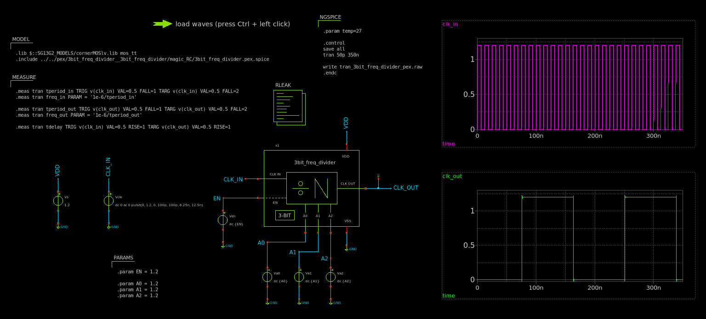

#### Divider Cell Testbench

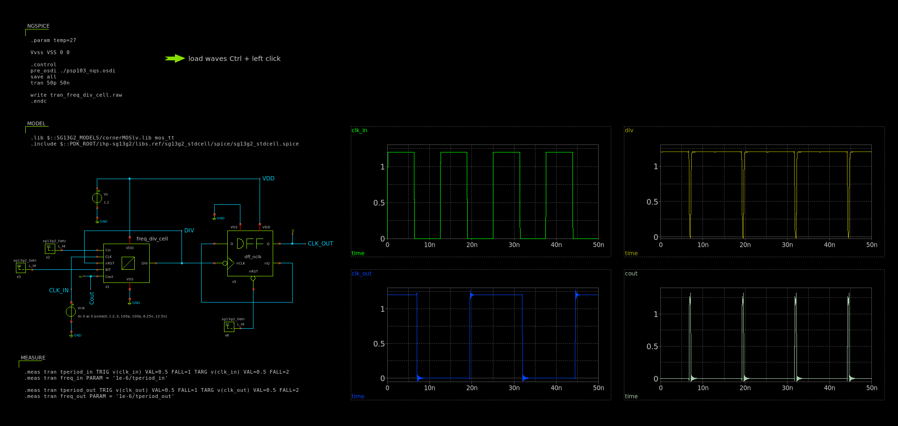

#### Half Adder Testbench

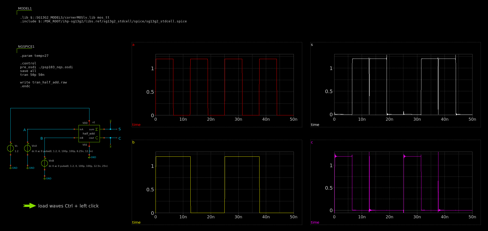

#### DFF with Inverterd CLK Testbench

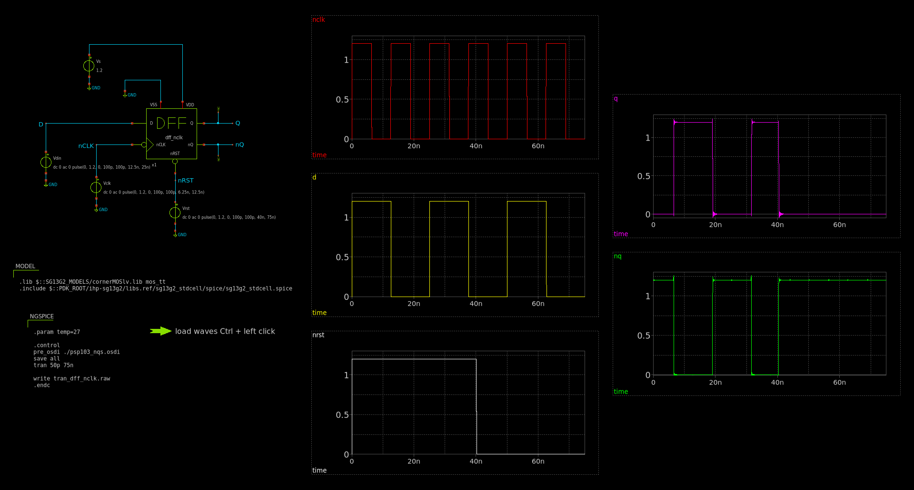

[Return to top](#toc)

---

## 7. Control Interface
[Return to top](#toc)

---

## 8. Layout Design

### Charge Pump Layout  
  

  

### Loop Filter Layout  
  

  

### Bias Generator Layout  
  

  

### VCO Layout  
  

  

### Frequency Divider Layout  
  
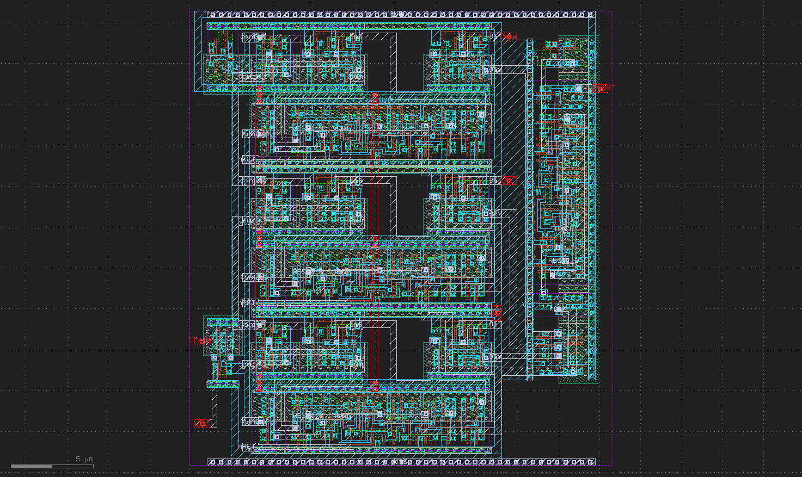

### PLL Layout (without fillers)  
  

  

### PLL Layout (with fillers)  
  

  

[Return to top](#toc)

### 9. PLL pinout
---

  
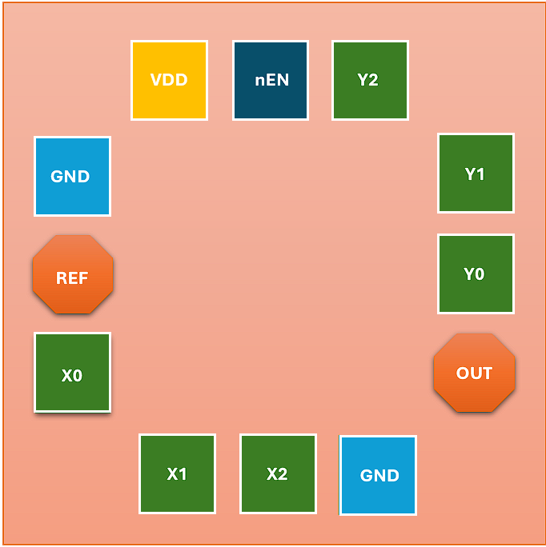

### 10. Layout Information
---

|           | Width (µm) | Height (µm) | Pitch (µm) | Area (µm²) |   Layers   |
|-----------|------------|-------------|------------|------------|------------|
| Layout    | 400        | 400         | -          | 160,000    |    all     |
| Pads      | 60         | 60          | 75         | 3,600      |  TM2 -  M3 |
| RF Pads   | 60         | 60          | 75         | ~2,984     |  TM2 - TM1 |

## 9. Physical Verification (DRC, LVS)

### Design Rule Check (DRC) Results

### Layout vs. Schematics (LVS) Results 

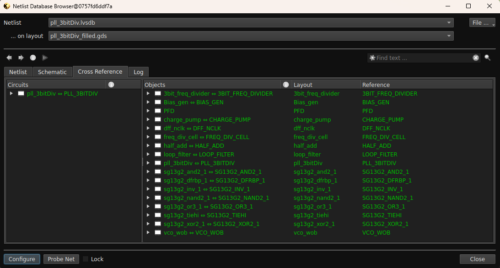

[Return to top](#toc)

---

## 10. Post-layout Verification after PEX

### For a division ratio of 1 (M = 1 and N = 1)

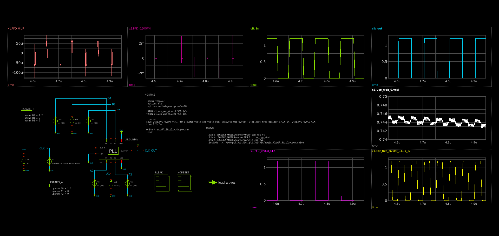
 

### For a division ratio of 1/7 (M = 1 and N = 7)

### For a division ratio of 3 (M = 3 and N = 1)

[Return to top](#toc)

---

## 11. GDS Streaming

[Return to top](#toc)
