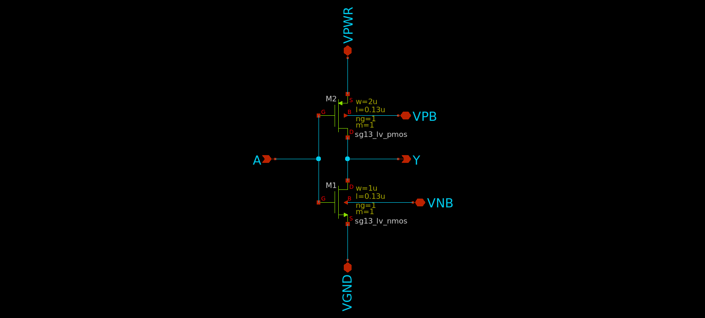

## A PFD-CP Type-II Fractional-N Phase Locked Loop (PLL) Clock Multiplier Layout in IHP SG13G2 Process

# Table of Contents

1. [Members](#members)
2. [Overview of the Project](#overview)
3. [Specifications of the Project](#specs)
4. [Circuit Design](#circuit)
    - [Phase-Locked Loop (PLL)](#pll)
    - [Phase-Frequency Detector (PFD)](#pfd)
    - [Charge Pump (CP)](#cp)
    - [Loop Filter](#lf)
    - [Bias Generator](#bias)
    - [Voltage-Controlled Oscillator (VCO)](#vco)
    - [Frequency Divider (FD)](#fd)
5. [Simulation Results (Pre-Layout)](#sim)
    - [Output Waveform of the VCO](#sim_vco)
    - [Operation of the Charge Pump](#sim_cp)
    - [Frequency Divider Output Waveform for a Divider Ratio = 7](#sim_fd)
    - [Integrated PLL Simulation for M = 1 and N = 1 (Multiplication Factor = 1)](#sim_pll)
6. [Layout Design](#layout)
    - [Charge Pump Layout](#lay_cp)
    - [Loop Filter Layout](#lay_lf)
    - [Bias Generator Layout](#lay_bias)
    - [VCO Layout](#lay_vco)
    - [Frequency Divider Layout]((#lay_fd))
    - [PLL Layout (without fillers)](#lay_plln)
    - [PLL Layout (with fillers)](#lay_pllf)
7. [PLL Pinout](#pinout)
8. [Layout Information](#layout_info)
9. [Physical Verification (DRC, LVS)](#pv)
10. [Post-layout Verification after PEX](#pex)
    - [Simulation for a Multiplier Ratio of 1 (M = 1 and N = 1)](#pex_m1_n1)  
    - [Simulation for a Multiplier Ratio of 1/7 (M = 1 and N = 7)](#pex_m1_n7) 
    - [Simulation for a Multiplier Ratio of 3 (M = 3 and N = 1)](#pex_m3_n1)       
11. [IHP OpenMPW Submission](#mpw)
12. [References](#ref)

---

## 1. Members (Department of Electronic and Telecommunication Engineering, University of Moratuwa)

- Yasiru Amarasinghe (T1)  
- Nilasi Methsarani (T1)  
- Nimesh Kavinda (T1)  
- Avishka Herath (T2)  
- Manimohan Thiriloganathan (T2)  
- Hansa Marasinghe (T2)  
- Upeksha Dilhara (T2)  
- Instructor: Kithmin Wickremasinghe (MASc)  
- Supervisor: Dr. Subramaniam Thayaparan (PhD)  

[Return to top](#toc)

---

## 2. Overview of the Project
This project implements a charge-pump (CP) based (Type-II) Phase-Locked Loop (PLL) system designed to generate programmable output frequencies from a stable `10 MHz` reference input. The architecture uses a Voltage-Controlled Oscillator (VCO) together with two 3-bit programmable Frequency Dividers (FDs) to achieve a tunable output frequency.

### Architecture
- **Feedback Divider (M):**  
  Divides the VCO output by a `3-bit integer input M`. This allows the PLL to lock the VCO frequency at an integer multiple of the reference input:  
  `f_vco = M × f_ref`
- **Output Divider (N):**  
  Divides the VCO output by a `3-bit integer input N` to produce the final output:  
  `f_out = f_vco / N`

### Frequency Relationship
By configuring **M** and **N** via six digital I/O control pads (3 bits each), the system achieves a fractional multiplication of the reference input:
`f_out = (M / N) × f_ref`
Since both M and N can be varied between 1 and 7, the **theoretical frequency range** spans from `1.428 MHz to 70 MHz`, based on the 3-bit divider limits. However, due to VCO constraints, the **practical output frequency range** is limited to approximately `1.428 MHz to 30 MHz`. This design demonstrates a compact, digitally controlled fractional frequency synthesizer, suitable for clock generation and frequency scaling applications.

[Return to top](#toc)

---

## 3. Specifications of the Project
The purpose of this design was to develop a 30 MHz fractional-N PLL (Phase-Locked Loop) that meets the specified performance criteria while minimizing power consumption and area. The design should be suitable for integration into a larger system-on-chip (SoC) and capable of supporting various output clock frequencies.

| **Parameter**               | **Value**              |
|-----------------------------|------------------------|
| Reference Frequency         | 10 MHz                 |
| Fractional Division Ratio   | 1/7 to 3               |
| Output Frequency Range      | 1.428 MHz to 30 MHz    |
| Supply Voltage              | 1.2 V                  |
| Average Power Consumption   | 304.05 µW              |
| Output Slew Rate            | 1618.55 V/µs           |

[Return to top](#toc)

---

## 4. Circuit Design

### 4.1 Phase-Locked Loop (PLL)
The top-level schematic of `PLL_3BIT_DIV` is shown below:

The PLL uses a standard fractional-N architecture, where a feedback and output frequency dividers are used to set the frequency multiplication with respect to the reference clock input.

### 4.2 Phase-Frequency Detector (PFD)

 

The phase-frequency detector compares the phase of the input reference clock `ref_clk` with that of the VCO output `vco_clk`. It generates two control signals, `up` and `down`, which drive the charge pump to adjust the VCO's control voltage.

### 4.3 Charge Pump (CP)

 

The charge pump uses two current sources (`bias_p` and `bias_n`), which are switched to the output by the `up` and `down` control signals. The nominal charge pump current (set by the bias generator) is configurable to suit the PLL requirements.

### 4.4 Loop Filter
The loop filter is used to filter out the high frequency variations in the charge pump output and provide a stable control voltage to the VCO.

  

### 4.5 Bias Generator
The bias generator design in this project is also based on the [tt08-tiny-pll](https://github.com/LegumeEmittingDiode/tt08-tiny-pll), but we added an extra resistor to increase `bias_n` value. The bias generator is a self-biased current mirror, which provides a roughly supply-independent current for the charge pump. A startup circuit is included to ensure the bias generator does not fall into an undesirable operating point where `I_OUT = 0`. The diode devices `M3` and `M7` charge the `kick` node to `VPWR` when the circuit is enabled, which pulls `bias_p` low and establishes a current in the mirror devices. Once the mirror is active, `M3` pulls `kick` low and disables the startup circuit.

  

### 4.6 Voltage-Controlled oscillator (VCO)
Each stage is a standard-cell inverter with delay controlled by current-limiting transistors. The use of 11 stages sets the oscillation frequency in the MHz range and improves phase noise performance by spreading delay across multiple elements.

#### Inverter for VCO

  

#### 11-Stage Ring VCO
A control transistor operating in the triode region regulates the current supplied to the inverter chain, enabling smooth tuning of the oscillation frequency. Minimum channel-length devices are used to maximize the W/L ratio, reduce `V_DSAT`, and minimize parasitic capacitances.

 

Low-threshold (LVT) NMOS devices are employed so that the control voltage operates around mid-supply, ensuring robust operation across process and temperature variations. The nominal oscillation frequency is approximately `50 MHz`, with tuning capability around this point. Dedicated keeper devices are included to disable the oscillator during standby, achieving zero static power consumption when the circuit is turned off.

### 4.7 Frequency Divider (FD)
A frequency divider is implemented using a 3-bit binary counter, followed by three XOR gates to compare the counter output with the division ratio input `A[2..0]`. When the counter output is equal to `BIT`, `DIV_RST` is immediately triggered, which resets the counter to 0 at the rising edge of `CLK_IN`. As a result, the maximum division ratio from `CLK_IN` to `DIV_RST` is 7, when `BIT == 3'b111`.

 

The D flip-flop (DFF) at the output is included to ensure an output duty cycle close to 50%. As a result, the actual output frequency is `f_ref / (2 x BIT)`, which implies a division ratio from `CLK_IN to CLK_OUT` between `2 and 14`.

#### Frequency Divider Cell

The architecture of a 1-bit divider is shown above. Multiple instances of this cell is used to create the 3-bit divider.

#### Half Adder for Divider

#### DFF with Inverterd CLK for Divider

[Return to top](#toc)

---

## 5. Simulation Results (Pre-Layout)

### 5.1 Output Waveform of the VCO
We used the nominal control voltage as 1 V to characterize the VCO.

#### VCO Output Waveform at Control Voltage = 1 V  

The output Frequency of the VCO at a control voltage of 1 V is approximately `50 MHz`.  

#### VCO Output Frequency Spectrum at Control Voltage = 1 V 

  

#### VCO Oscillation Frequency vs Control Voltage 
The VCO was characterized by measuring its output frequency while sweeping the control voltage. The results of this simulation are shown below:

  

### 5.2 Operation of the Charge Pump
Since the pulse width of the `up` signal is wider than that of the `down` signal, `v_out` charges, gradually increasing its voltage with each pulse.

   

### 5.3 Frequency Divider Output Waveform for a Divider Ratio = 7
- Input frequency - 80 MHz
- Output frequency - 5.71 MHz

### 5.4 Integrated PLL Simulation for M = 1 and N = 1 (Multiplication Factor = 1)
- Output frequency - 10.02 MHz

[Return to top](#toc)

---

## 6. Layout Design

### 6.1 Charge Pump Layout 
- Area: 26.03 µm² 

  

### 6.2 Loop Filter Layout 
- Area: 297.89 µm² 

  

### 6.3 Bias Generator Layout  
- Area: 354.17 µm²

  

### 6.4 VCO Layout 
- Area: 2246.58 µm² 

  

### 6.5 Frequency Divider Layout  
- Area: 715.22 µm²

### 6.6 Integrated PLL Layout (without Fillers) 

  

### 6.7 Integrated PLL Layout (with Fillers)  
- Area: 160000.00 µm²

 

[Return to top](#toc)

---

### 7. PLL Pinout

---

[Return to top](#toc)

---

### 8. Layout Information
---

|               | **Width (µm)** | **Height (µm)** | **Pitch (µm)** | **Area (µm²)** |   Layers   |
|---------------|----------------|-----------------|----------------|----------------|------------|
| **Layout**    | 400            | 400             | N/A              | 160,000        |    all     |
| **Pads**      | 60             | 60              | 75             | 3,600          |  TM2 -  M3 |
| **RF Pads**   | 60             | 60              | 75             | ~2,984         |  TM2 - TM1 |

[Return to top](#toc)

---

## 9. Physical Verification (DRC, LVS)

### Design Rule Check (DRC) Results

### Layout vs. Schematics (LVS) Results 

[Return to top](#toc)

---

## 10. Post-layout Verification after PEX

### 10.1 Simulation for a Multiplier Ratio of 1 (M = 1 and N = 1)
- Output frequency - 8.03 MHz

 

### 10.2 Simulation for a Multiplier Ratio of 1/7 (M = 1 and N = 7)
- Output frequency - 1.43 MHz

 

### 10.3 Simulation for a Multiplier Ratio of 3 (M = 3 and N = 1)
- Output frequency - 27.71 MHz

 

[Return to top](#toc)

---

## 11. IHP OpenMPW Submission
Tapeout submission for the July 2025 edition of the IHP OpenMPW program can be found at the following project repository.
- TO_July2025 - [https://github.com/avishkaherath/TO_July2025](https://github.com/avishkaherath/TO_July2025)

[Return to top](#toc)

---

## 12. References
The following open-source PLL designs were referred to during the development of this project:
- tt08-tiny-pll - [https://github.com/LegumeEmittingDiode/tt08-tiny-pll](https://github.com/LegumeEmittingDiode/tt08-tiny-pll)
- avsdpll_1v8 - [https://github.com/lakshmi-sathi/avsdpll_1v8](https://github.com/lakshmi-sathi/avsdpll_1v8)

[Return to top](#toc)